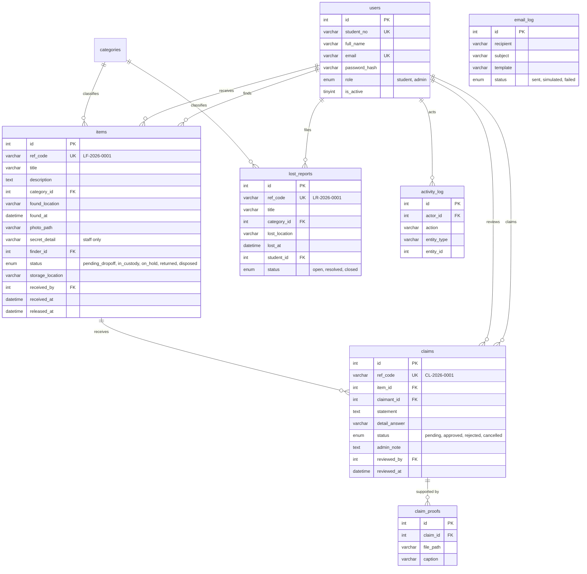

# Entity relationship diagram

```mermaid
erDiagram
    users ||--o{ items         : "finds"
    users ||--o{ items         : "receives"
    users ||--o{ lost_reports  : "files"
    users ||--o{ claims        : "claims"
    users ||--o{ claims        : "reviews"
    users ||--o{ activity_log  : "acts"
    categories ||--o{ items        : "classifies"
    categories ||--o{ lost_reports : "classifies"
    items ||--o{ claims        : "receives"
    claims ||--o{ claim_proofs : "supported by"

    users {
        int id PK
        varchar student_no UK
        varchar full_name
        varchar email UK
        varchar password_hash
        enum role "student, admin"
        tinyint is_active
    }

    items {
        int id PK
        varchar ref_code UK "LF-2026-0001"
        varchar title
        text description
        int category_id FK
        varchar found_location
        datetime found_at
        varchar photo_path
        varchar secret_detail "staff only"
        int finder_id FK
        enum status "pending_dropoff, in_custody, on_hold, returned, disposed"
        varchar storage_location
        int received_by FK
        datetime received_at
        datetime released_at
    }

    lost_reports {
        int id PK
        varchar ref_code UK "LR-2026-0001"
        varchar title
        int category_id FK
        varchar lost_location
        datetime lost_at
        int student_id FK
        enum status "open, resolved, closed"
    }

    claims {
        int id PK
        varchar ref_code UK "CL-2026-0001"
        int item_id FK
        int claimant_id FK
        text statement
        varchar detail_answer
        enum status "pending, approved, rejected, cancelled"
        text admin_note
        int reviewed_by FK
        datetime reviewed_at
    }

    claim_proofs {
        int id PK
        int claim_id FK
        varchar file_path
        varchar caption
    }

    email_log {
        int id PK
        varchar recipient
        varchar subject
        varchar template
        enum status "sent, simulated, failed"
    }

    activity_log {
        int id PK
        int actor_id FK
        varchar action
        varchar entity_type
        int entity_id
    }
```

Paste this into any Mermaid renderer, or into a GitHub markdown file, to get the diagram
for your documentation chapter.
